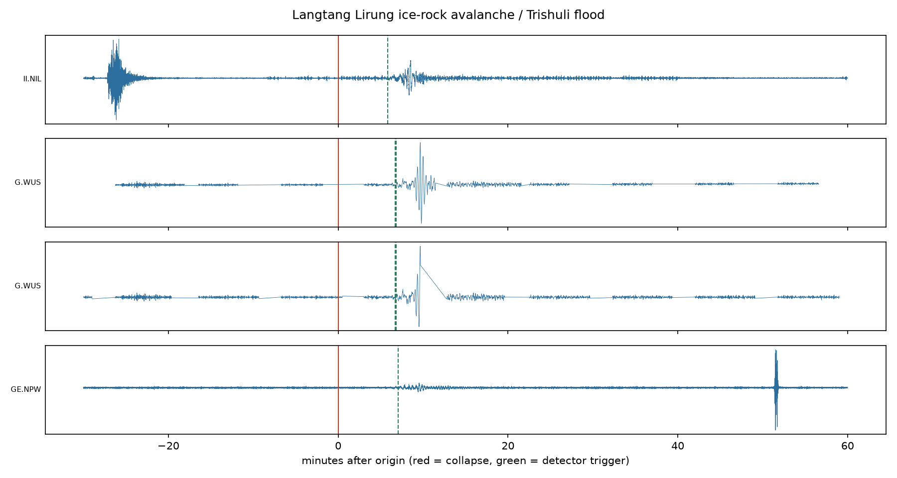

# Third Pole Watch

An open seismic watch for the Himalaya: detect large mass movements (glacier
collapses, ice-rock avalanches, debris flows) on **public real-time seismic
feeds** within minutes, and notify a human subscriber list — researchers,
hydropower control rooms, trekking operators — long before the current
phone-chain does.

**Why.** On 26 Aug 2026 a collapse near Langtang Lirung registered Ms 5.2 on
seismometers worldwide at 08:37 NPT. Nepal's first SMS alert went out at 09:15,
triggered by a customs officer's phone call. The ~35 lost minutes were the
difference between life and death for the middle Trishuli valley. The science
for automated seismic detection of catastrophic flows was validated on the 2021
Chamoli disaster (Cook et al., *Science* 2021). No operational system anywhere
runs it. This repo is the smallest thing that changes that.

**First result** — replaying 26 Aug 2026 on four open stations, uncalibrated
v0 thresholds:

```
== COINCIDENT DETECTION at T+349s (3 stations: II.NIL, G.WUS, GE.NPW)
   Actual first SMS alert: T+2280s (+38 min). Margin recovered: 32 minutes.
```



This is **not** a public alerting system. Alerts here are unconfirmed
"check-your-sources" signals for subscribed humans with their own duty of care
(a hydropower safety officer may evacuate their own tunnels on any information
they trust). Official public warnings are the sovereign role of national
agencies (DHM/NDRRMA in Nepal).

## Quickstart

```bash
python -m venv .venv && . .venv/bin/activate
pip install -e ".[dev]"

# 1. Replay the 2026 Trishuli collapse from public waveform archives
tpw replay trishuli2026            # fetches data, runs detector, writes out/

# 2. Replay Chamoli 2021 (the validation case from the Science paper)
tpw replay chamoli2021

# 3. Run the live watch (SeedLink real-time streams)
export TPW_TELEGRAM_BOT_TOKEN=...  # optional; alerts print to stdout without it
export TPW_TELEGRAM_CHAT_ID=...
tpw watch

# 4. Inspect the candidate ledger / false-alarm score
tpw ledger stats
```

## How it works

```
FDSN archives (IRIS/EarthScope, GEOFON)     SeedLink real-time streams
        │  (replay)                                │  (live)
        ▼                                          ▼
   waveform fetch ──► detector: STA/LTA trigger on broadband envelope
                              + long-period/high-frequency energy ratio
                              + duration  + multi-station coincidence
                              + FDSN event-catalog cross-check
                                          │
                              candidate ledger (append-only JSONL)
                                          │
                              Telegram / stdout alert to subscribers
```

The v0 discriminator is a documented heuristic: mass movements radiate
long-period energy with emergent onsets and long durations, unlike impulsive
tectonic earthquakes. Calibrating it (and replacing it with a real classifier)
is exactly the collaboration this repo exists to start — see Cook et al. 2021
(https://www.science.org/doi/10.1126/science.abj1227) and GFZ Potsdam's public
call for a Himalayan end-to-end demonstrator.

## The ledger is the product

Nobody should ever wire a detector to public alerting without a measured
false-alarm rate. Every candidate this system flags — true, false, ambiguous —
is recorded in `~/.thirdpole/ledger.jsonl` forever. The long-running score
("N days up, X candidates, Y verified") is what turns a demo into
infrastructure.

## Honest limitations (v0)

- Runs on **open** stations only (IU/II/IC/GE + Raspberry Shake). The densest
  regional networks (Nepal NSC, Chinese and Indian national networks) are not
  openly streamed; detection latency on open stations may be T+5–10 min rather
  than the T+2 achievable regionally. Station-access mapping is task #1.
- The discriminator is uncalibrated; the replay commands exist to calibrate it.
- Coincidence logic is naive (fixed time window, no move-out correction).
- Not an official warning system, and must never present itself as one.

## Roadmap

1. Replay both reference events; publish the detection-time plots.
2. Run the live watch for months; publish the ledger.
3. Take the measured baseline to GFZ Potsdam / ICIMOD as the engineering half
   of their proposed demonstrator.
4. Densify with community seismometers (Raspberry Shake, ~$400/node) in the
   priority corridors.

License: MIT. Contributions welcome — especially from seismologists.
